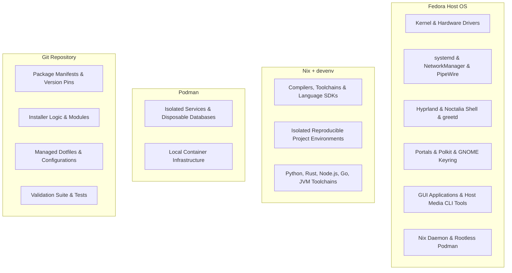
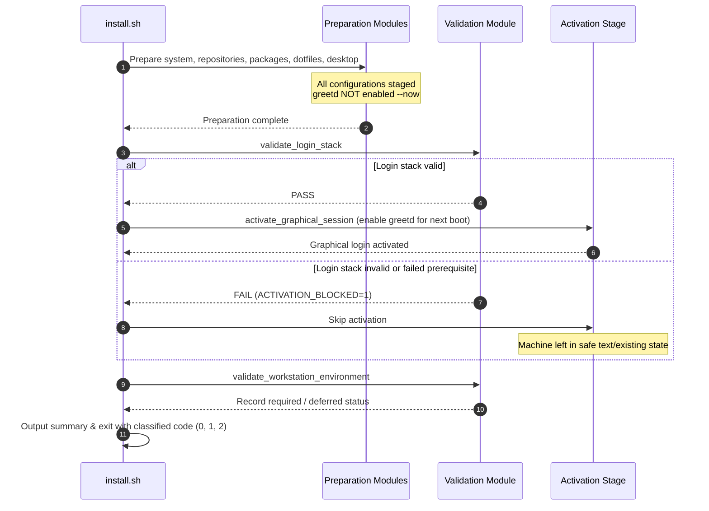

# Workstation Architecture and Ownership Model

This document specifies the authoritative ownership boundaries, module architecture, and lifecycle model for the Fedora Hyprland Workstation.

---

## 1. Ownership Boundaries

### Fedora Host
- **Kernel, firmware, and hardware drivers**: Direct hardware management, graphics (Mesa, VA-API), audio (PipeWire, WirePlumber), Bluetooth, and NetworkManager.
- **Desktop session**: Hyprland compositor, Noctalia desktop shell, `greetd` display manager with `noctalia-greeter`, `hyprpolkitagent`, `xdg-desktop-portal-hyprland`, and fonts.
- **Host applications**: Web browsers (Chromium, Brave Origin, Firefox, Ulaa via Flatpak), Kate, Cursor, ChatGPT, LocalSend, Neovim, and host-global media utilities (`mpv`, `ffmpeg`, `mediainfo`, `mkvmerge`, `MP4Box`, `ccextractor`, `mp4dump`, `packager`, `dovi_tool`, `N_m3u8DL-RE`).
- **Container and package manager daemons**: Fedora Nix package manager and `nix-daemon.service`, rootless Podman container runtime.

### Nix + devenv
- **Development toolchains**: Compilers (GCC, Clang, Rust, Go), SDKs, language runtimes (Python, Node.js, OpenJDK), package managers (Cargo, npm, pip), and development shells.
- **Rule**: Development compilers and SDKs are **never** installed globally on the Fedora host unless required for core OS driver compilation. Projects define reproducible environments via `devenv.nix` / `flake.nix`.

### Podman
- **Container services**: Local databases (PostgreSQL, Redis, MySQL), microservices, disposable build containers, and rootless development services.
- **Rule**: Podman provides container isolation without requiring a root daemon. Docker CE is not installed as default.

### Git Repository
- **Desired state**: The Git repository is the sole source of truth.
- State in `/var/lib/fedora-hyprland-workstation/` is purely an execution journal and run log, not a second configuration database.

---

## 2. Module Responsibilities

| Module | Purpose |
| --- | --- |
| `install.sh` | CLI entry point, argument parsing, lifecycle traps, lock management, orchestration. |
| `modules/common.sh` | Shared aggregator sourcing `modules/lib/*.sh` and running system pre-flight checks (`validate_profile`, `validate_fedora`, `validate_target_user`, `prepare_system`). |
| `modules/lib/output.sh` | Terminal formatting and logging primitives (`info`, `warn`, `error`, `die`). |
| `modules/lib/execution.sh` | Privilege transitions (`run_as_target_user`), timeouts (`run_with_timeout`), retries (`run_with_retry`), booleans, root file installation. |
| `modules/lib/filesystem.sh` | Filesystem primitives with path guards and collision-safe backup handling (`ensure_directory`, `ensure_symlink`). |
| `modules/lib/packages.sh` | DNF and RPM query and transaction wrappers (`package_installed`, `package_available`, `install_dnf_packages`). |
| `modules/lib/artifacts.sh` | Cryptographic verification, HTTPS validation, deterministic archive structural inspection, and binary provisioning. |
| `modules/status.sh` | Run outcome classification, failure recording, and human-readable summary generation. |
| `modules/state.sh` | State directory initialization (`/var/lib/fedora-hyprland-workstation`), journaling, failure notes, and fail-closed concurrency locking (`flock`). |
| `modules/repositories.sh` | Idempotent third-party repository configuration (COPRs: `lionheartp/Hyprland`, `atim/starship`; RPM Fusion Free & Nonfree). |
| `modules/packages.sh` | Manifest-based package installation (`packages/*.txt`). |
| `modules/shell.sh` | Zsh configuration, Oh My Zsh, plugins, Starship, Kitty, Neovim config, and standard XDG user directories initialization. |
| `modules/browsers.sh` | Host browser installation (Chromium mandatory, Brave Origin and Firefox optional). |
| `modules/applications.sh` | Workstation applications (Cursor, ChatGPT, Kate, GUI media apps, host-global media utilities, Antigravity CLI). |
| `modules/flatpak.sh` | Flatpak runtime, Flathub remote, and Flatpak applications (LocalSend, Ulaa). |
| `modules/desktop.sh` | Hyprland config deployment, Noctalia shell, `greetd` service and `noctalia-greeter` configuration, desktop services enablement. |
| `modules/nix.sh` | Fedora Nix packages, `nix-daemon` service enablement, `nix.conf` user feature merge, and pinned `devenv` profile installation. |
| `modules/containers.sh` | Podman, Buildah, Skopeo, rootless subuids/subgids configuration, and user socket enablement. |
| `modules/validation.sh` | Comprehensive read-only validation for graphical login safety and workstation capabilities. |
| `tests/run.sh` | Unified test entrypoint running isolated domain test suites (`tests/test_*.sh`). |

---

## 3. Transactional Prepare -> Validate -> Activate Lifecycle

1. **Prepare**: All packages, configurations, dotfiles, and services are deployed. `greetd` is **never** started or replaced in the running session (`systemctl enable --now` is prohibited during preparation).
2. **Validate**: `validate_login_stack` runs an exhaustive read-only capability check on Hyprland binaries, PAM modules, portal services, greeter executables, and config syntax.
3. **Activate**: Only if login stack validation passes is `greetd.service` enabled for the next boot. If validation fails, `ACTIVATION_BLOCKED=1` prevents enablement and the workstation remains in its safe previous state.
