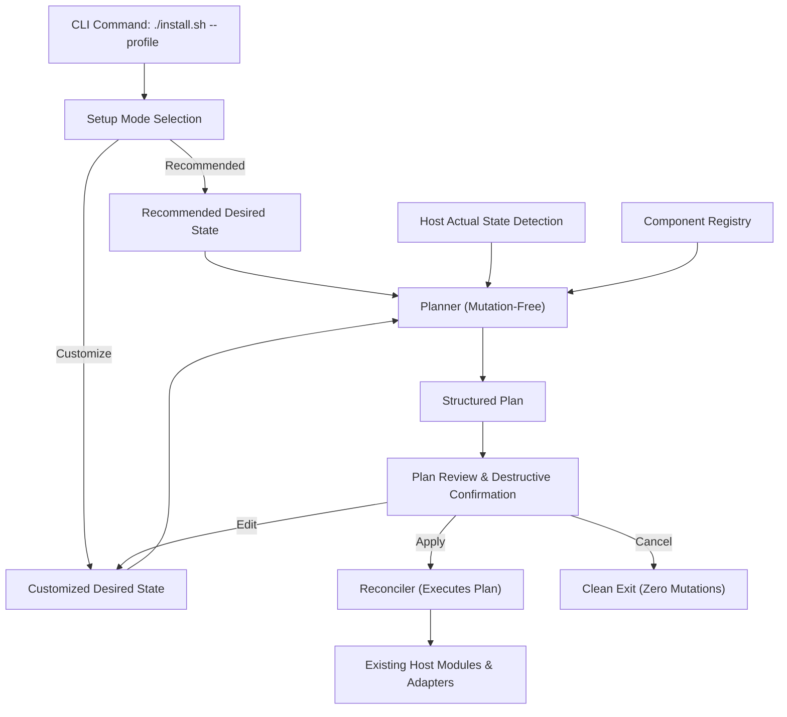

# Workstation Configuration Architecture

This document specifies the declarative configuration engine for the Fedora Hyprland Workstation: Component Registry, Desired State, Planner, Review, Reconciler, and interactive Setup Mode.

---

## 1. Primary Product Principle

The system is:

> **Opinionated by default, configurable by choice.**

Both **Recommended** and **Customize** setup modes flow through the exact same state pipeline:



---

## 2. Profile vs Setup Mode

Machine Profile and Setup Mode represent distinct, non-overlapping concerns:

### Profile: "What kind of machine or environment is this?"
- Controlled exclusively by the public CLI contract:
  ```bash
  ./install.sh --profile workstation
  ./install.sh --profile vm
  ```
- Governs hardware-level policies, GPU graphics drivers (`generic` vs `virtio`), Bluetooth integration, virtual machine optimizations, and environment constraints.
- Exactly two public profile commands exist. No `--customize`, `--recommended`, or `--minimal` CLI flags exist.

### Setup Mode: "What workstation configuration does the user want?"
- Selected after profile initialization:
  - **Recommended Workstation**: Complete, opinionated repository configuration.
  - **Customize Workstation**: Granular selection of applications, utilities, and role defaults.
- A virtual machine can be customized, and a physical workstation can run recommended defaults. Profile and setup mode are completely orthogonal.

---

## 3. Component Registry

The Component Registry (`modules/lib/components.sh`) provides declarative definitions of workstation capabilities, applications, and tools.

### Component Metadata Schema
Every component declares machine-oriented attributes:
- `id`: Stable, unique identifier (`^[a-z0-9_]+$`).
- `display_name`: Human-readable label.
- `category`: Grouping category (e.g. `Browsers`, `Desktop`, `Development`, `Diagnostics`).
- `description`: Summary of component capability.
- `supported_profiles`: Space-delimited list of supported profiles (`workstation vm`).
- `recommended`: Boolean (`true` / `false`) indicating default recommendation.
- `required`: Boolean (`true` / `false`). Required components cannot be deselected or removed.
- `removable`: Boolean (`true` / `false`). Indicates if safe package removal is supported.
- `dependencies`: Space-delimited list of prerequisite component IDs.
- `conflicts`: Space-delimited list of mutually exclusive component IDs.
- `provides`: Abstract capability tokens provided.
- `requires`: Abstract capability tokens required.
- `roles`: Supported system-wide defaultable roles (`browser`, `terminal`, `login-shell`, `text-editor`).
- Lifecycle adapters: Function references for `detect_fn`, `install_fn`, `configure_fn`, `validate_fn`, `remove_fn`.

### Registry Invariants
- **No arbitrary `eval`**: Lifecycle hooks are declarative function references, never dynamically executed shell strings.
- **Self-validation**: The registry validates referential integrity (`validate_component_registry`):
  - Rejects duplicate component IDs.
  - Verifies all declared dependencies exist in the registry.
  - Verifies all declared conflicts exist in the registry.
  - Prohibits self-dependencies and self-conflicts.
  - Prohibits required components from conflicting with other required components.
  - Enforces that required components cannot be marked removable.
  - Enforces supported role constraints.

---

## 4. Actual State vs Desired State

A fundamental architectural principle is:

> `installed != selected`

The engine maintains three independent state models:

1. **Actual State**:
   What is currently installed and active on the host machine (`PRESENT` vs `ABSENT`).
2. **Desired Management State**:
   What the user intends the installer to manage:
   - `managed`: The installer actively manages and provisions the component.
   - `unmanaged`: The installer does not manage the component.
   - `remove`: The component is explicitly marked for safe removal.
3. **Preference / Default State**:
   Which installed provider holds the default association for a role.

### Preexisting Software Safety
If the installer finds software already installed on the host that is **not** selected in the wizard:
- It becomes `unmanaged` (`KEEP`).
- It is **never** automatically removed.
- Deselection in customization never implies removal. Removal must be explicit.

### Remove vs Purge Semantics
- **`REMOVE`**:
  Safely uninstalls the managed package/binary via standard package managers (`sudo dnf remove -y <pkg>`).
  Never deletes personal files, browser profiles, user documents, or arbitrary dotfiles.
- **`PURGE`**:
  Destructive cleanup of personal configuration and user data.
  Purge is strictly prohibited from standard component removal and deselection flows.

---

## 5. Roles and Default Capabilities

System-wide defaults are modeled as generic capability roles rather than hardcoded conditionals:

- Supported roles: `browser`, `terminal`, `login-shell`, `text-editor`.
- **Presence != Default**: Multiple browsers (e.g. Chromium and Firefox) may be installed simultaneously. The user explicitly selects which installed provider serves as the primary system default.
- **Independence**: If Chromium is selected as default while Firefox is unmanaged, Firefox is kept intact, and the default MIME associations are updated to Chromium via `xdg-mime`.
- **No Fabricated Defaults**: If zero providers exist for a role, no default is fabricated.

---

## 6. Dependency and Conflict Resolution

- **Declarative Dependencies**:
  Components declare dependencies directly (e.g. `devenv` depends on `nix`).
- **Automatic Inclusion**:
  If a user selects `devenv` while `nix` is unselected, the planner automatically resolves `nix` to `managed` and records the explicit reason (`required by devenv`).
- **Unresolved Dependencies Fail Closed**:
  If a component requires a dependency that is explicitly marked for removal (`remove`), planning fails closed before mutation.
- **Conflict Prevention**:
  Mutually conflicting components cannot both be `managed`. Any unresolved conflict aborts planning before execution.

---

## 7. Planner (Mutation-Free)

The Planner (`modules/lib/planner.sh`) is strictly read-only and performs zero system mutations:

- Consumes: Desired State + Actual State + Component Registry.
- Produces: An immutable, validated Plan consisting of discrete actions:
  - `INSTALL`: Component is absent and desired `managed`.
  - `KEEP`: Component is present and desired `managed` or `unmanaged`.
  - `CONFIGURE`: Component is present and has an updated configuration.
  - `REMOVE`: Component is present and explicitly desired `remove`.
  - `CHANGE_DEFAULT`: Desired role provider differs from current host default.
- Every action records target ID, action type, descriptive reason, and details.

---

## 8. Review and Confirmation

Before any host mutation occurs, the Review Screen (`format_plan_summary`):
- Displays the complete plan broken down by action type.
- Tallies exact counts (install, configure, keep, remove, default changes).
- **Destructive Warning**: Any plan containing `REMOVE` actions visibly highlights destructive operations and requires an explicit confirmation (`yes`).
- Interactive options:
  - `[A] Apply changes`: Proceeds to reconciliation.
  - `[E] Edit selections`: Returns to the customization wizard.
  - `[C] Cancel setup`: Terminates the run immediately with zero mutations.

---

## 9. Reconciler

The Reconciler (`modules/lib/reconciler.sh`):
- Executes an already validated and confirmed Plan.
- Does not make policy decisions.
- Invokes component lifecycle adapters in safe dependency order:
  1. `REMOVE` actions (safe package removal).
  2. `INSTALL` actions (`install_fn` -> `configure_fn` -> `validate_fn`).
  3. `CONFIGURE` actions.
  4. `CHANGE_DEFAULT` actions (role association updates).
- Surfaces failures through the standard repository failure classification subsystem (`record_required`, `record_deferred`).

---

## 10. Non-Interactive Terminal Safety

- `wizard_is_interactive()` verifies that standard input is an interactive TTY (`[[ -t 0 ]]`).
- If invoked non-interactively (e.g. headless automation or background pipe) without an explicit `SETUP_MODE` environment variable:
  - The installer fails closed immediately:
    ```text
    ERROR: Interactive terminal required for setup mode selection. Run in an interactive terminal.
    ```
  - It does not hang waiting for input and does not silently apply unreviewed changes.
- Automated testing and scripted workflows can pass `SETUP_MODE=recommended` or `SETUP_MODE=customize` to bypass keyboard menus deterministically.

---

## 11. Migration and Coexistence Strategy

The architecture coexists with established installer modules:
- Login-critical activation (`greetd`, `Hyprland`, `Noctalia`) remains intact and isolated.
- The reconciler executes alongside existing classified stages.
- Representative components (`chromium`, `firefox`, `foot`, `neovim`, `nix`, `devenv`, `htop`) prove the registry, roles, dependencies, and removal flows without disrupting the overall desktop stack.

---

## 12. Future Quickshell Frontend Boundary

The architecture cleanly decouples the configuration engine from terminal rendering:

```text
Terminal Wizard (modules/lib/wizard.sh) ──────┐
Recommended Baseline ─────────────────────────┼──> Desired State ──> Planner ──> Reconciler
Future Quickshell UI (IPC / CLI Adapter) ─────┘
```

A future graphical Quickshell Control Center will produce the same normalized Desired State representation and invoke the exact same Planner and Reconciler engine without duplicating business logic or lifecycle code.

---

## 13. What Remains Intentionally Unimplemented

In accordance with strict change discipline:
- Quickshell frontend UI.
- Noctalia replacement.
- Mass migration of all packages into the registry.
- AI Bridge and dictation services.
- Large new third-party software catalog.
