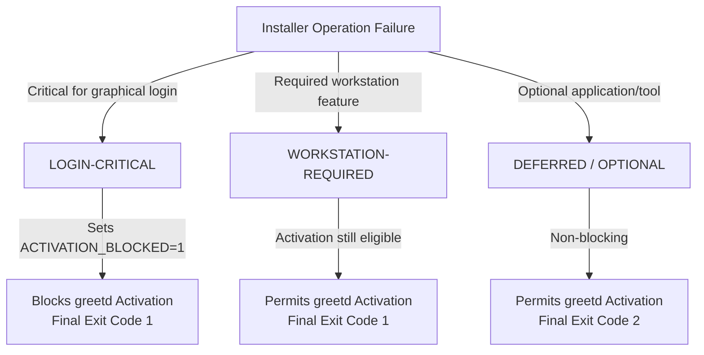

# Workstation Safety & Security Engineering

This document specifies the safety invariants, privilege policies, data protection rules, and failure classification model enforced by the Fedora Hyprland Workstation installer.

---

## 1. Privilege Boundaries & Least Privilege

The installer adheres strictly to the principle of least privilege:

- **Non-Root Execution**: `install.sh` must be executed as the normal workstation user (`$TARGET_USER`), never directly as `root`. Running as root risks deploying user configurations and dotfiles with root ownership.
- **Sudo Scoping**: `sudo` is used only for specific host-level operations (e.g. writing `/etc/greetd/config.toml`, installing RPMs via `dnf`, enabling systemd system units, managing `/var/lib/noctalia-greeter`).
- **Target User Transitions (`run_as_target_user`)**:
  - Privilege transitions use genuine UID matching: `OVERRIDE_EUID == target_uid` or `sudo -u "$TARGET_USER" env HOME="$TARGET_HOME" USER="$TARGET_USER" "$@"`.
  - Spoofed `USER` or `HOME` environment variables are rejected.
  - If a required user transition cannot be performed safely, the installer **fails closed**.
  - Generic target-user commands inherit the caller's active locale without global `LC_ALL` pollution.

---

## 2. User Data & Configuration Safety

Configuration targets are strictly categorized:

| Category | Policy |
| --- | --- |
| **Project-Owned** | Managed symlinks (e.g. `~/.config/hypr` -> `dotfiles/hypr`, `~/.zshrc`). If a non-symlink file or directory pre-exists, it is moved to a timestamped `.bak` backup before symlinking. |
| **User-Owned** | User directories and files (e.g. `~/.config/user-dirs.dirs`, `~/.config/nix/nix.conf`, documents in `~/Documents`). Existing custom entries are parsed safely and preserved; settings are merged without wiping custom configurations. |
| **System-Owned** | Distro system configuration files. Replaced or created only with minimal drop-ins (e.g. `/etc/greetd/config.toml`). |
| **Generated** | Logs and journals in `/var/lib/fedora-hyprland-workstation/`. |

### Prohibited Operations
- **No recursive home chowning**: `chown -R` against `$TARGET_HOME` is prohibited.
- **No blind deletions**: `rm -rf` against unvalidated or user-controlled paths is prohibited.
- **Path guards**: `ensure_directory` and `ensure_symlink` require non-empty, validated paths.

---

## 3. Failure Classification

Failures are recorded into three distinct severity classes:

1. **LOGIN-CRITICAL (`record_activation_failure`)**:
   - Hyprland compositor, greetd, noctalia-greeter, polkit agent, desktop portals, PAM keyring module.
   - Blocks graphical login activation (`ACTIVATION_BLOCKED=1`).
   - Prevents an unbootable graphical state.
2. **WORKSTATION-REQUIRED (`record_required`)**:
   - Base CLI utilities, Chromium, Zsh/Starship, Nix daemon, rootless Podman.
   - Does not block graphical login if the login stack itself is intact.
   - Yields exit code 1 to alert human maintainers/CI.
3. **DEFERRED / OPTIONAL (`record_deferred`)**:
   - Optional workstation applications (Cursor, ChatGPT, Kate, GUI media apps, media CLI tools, Antigravity CLI, Ulaa Flatpak).
   - Safe to rerun; yields exit code 2.

---

## 4. Signal Handling, Timeouts & Concurrency

- **Bounded Execution**: Every network, package manager, and external download command is bounded via `run_with_timeout` with GNU `timeout --kill-after=10s`.
- **Signal Trapping**: `SIGINT` (130) and `SIGTERM` (143) are captured via traps, terminating all tracked child processes, releasing the installer lock, and terminating cleanly.
- **Concurrency Locking**: `install.sh` acquires an exclusive non-blocking `flock` on `/run/user/$EUID/fedora-hyprland-workstation-$EUID.lock`. If another installer process is active, it fails immediately with a clear error message. The lock is kernel-backed and automatically released if the process terminates or crashes.
