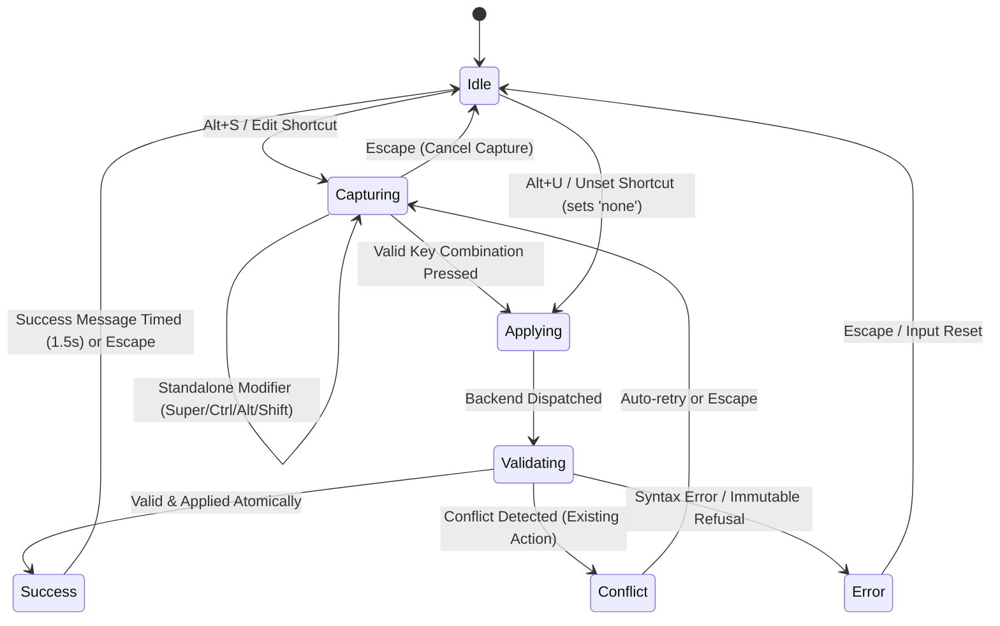

# Aurelia Keybindings Architecture Specification

This document specifies the architecture, lifecycle model, failure isolation boundaries, and design system contract for **Aurelia Keybindings** within the Fedora Hyprland Workstation.

---

## 1. Product Identity and Terminology

| Concept | Identifier / Label | Scope |
| :--- | :--- | :--- |
| **Internal Product Name** | `Aurelia Keybindings` | Engineering documentation, git commits, code comments |
| **User-Facing App Name** | `Keybindings` | Desktop entries (`Name=Keybindings`), window titles, UI header |
| **Generic Descriptor** | `Keyboard Shortcuts` | Desktop entry (`GenericName=Keyboard Shortcuts`) |
| **Primary Backend Binary** | `bin/workstation-keybindings` | System installation path: `/usr/local/bin/workstation-keybindings` |
| **Compatibility Wrapper** | `bin/workstation-hotkeys` | 25-line thin forwarding wrapper delegating to `workstation-keybindings` |
| **Component Registry ID** | `desktop.keybindings.aurelia` | Primary installer component (`desktop.hotkeys.aurelia` is compatibility alias) |
| **QML Component Directory** | `dotfiles/aurelia/components/keybindings/` | Source tree for `KeybindingsWindow.qml`, `KeybindingsModel.qml`, `KeybindingRow.qml` |
| **IPC Target** | `keybindings` | Quickshell IPC target (`hotkeys` preserved as forwarding alias) |

---

## 2. Failure Domains & Isolation Model

```mermaid
graph TD
    subgraph "Desktop Session Layer (Fail-Safe)"
        Greetd["greetd / noctalia-greeter"]
        Hyprland["Hyprland Wayland Compositor"]
        Activation["Graphical Session Activation"]
    end

    subgraph "Aurelia Process Boundary (Sandboxed)"
        Quickshell["Single Quickshell Process (--path dotfiles/aurelia)"]
        IPC["IPC Endpoint: keybindings"]
        Model["KeybindingsModel.qml (In-Memory State & Concurrency Guards)"]
        UI["KeybindingsWindow.qml (Layer-Shell Surface)"]
    end

    subgraph "Backend Execution Boundary (Double-Fork)"
        Backend["/usr/local/bin/workstation-keybindings"]
        LuaEngine["effective_bindings.lua / keybindings_manifest.lua"]
        Launcher["Double-Fork Grandchild (PPID=1 / init)"]
    end

    Hyprland -->|SUPER+K Dispatch| Backend
    Backend -->|IPC toggle| IPC
    IPC --> UI
    UI --> Model
    Model -->|Structured argv / run| Backend
    Backend -->|Detached Launch| Launcher
    Backend -.->|Non-blocking on failure| Hyprland

    style Activation fill:#2a273f,stroke:#9ccfd8,stroke-width:2px;
    style Quickshell fill:#232136,stroke:#f6c177,stroke-width:2px;
    style Launcher fill:#1f1d2e,stroke:#ea9a97,stroke-width:2px;
```

### 2.1 Component Level (UI & Model)
- **Safe JSON Parsing**: All backend JSON responses are parsed within `try { ... } catch (e)` blocks in `KeybindingsModel.qml`. Malformed output triggers a structured inline error state without crashing the Quickshell engine.
- **Concurrency Guards**: Dedicated boolean guards (`isReloading`, `isExecuting`, `isMutating`) prevent re-entrant dispatch. Concurrent user requests while an asynchronous operation is pending are safely dropped with warning logs.
- **Pure Native Wayland Layer-Shell**: The UI operates exclusively within the Wayland layer-shell protocol. No terminal emulators (`foot`, `kitty`, `xterm`) are ever spawned for UI presentation, key capture, or error reporting.

### 2.2 Process Level (Backend Execution)
- **Double-Fork Process Launch**: Action execution through `workstation-keybindings run <action_id>` uses a POSIX double-fork pattern:
  1. The parent orchestrator forks a launcher subshell.
  2. The launcher subshell invokes `( "$@" ) >/dev/null 2>&1 &` to spawn the target application and immediately terminates with status 0.
  3. The target application (grandchild) is instantly reparented to `systemd` / `init` (`PPID=1`).
  4. Zero intermediate wrapper shells or file descriptors are retained. No temporary files are created during execution.
- **Strict Structured `argv` Dispatch**: Commands are resolved from canonical manifests into structured argument arrays (`command_argv`). Command lines are never evaluated with `eval` or passed through arbitrary `sh -c` interpreters.

### 2.3 Desktop Session Level (Graphical Activation Invariance)
- **Non-Blocking Classification**: In accordance with `AGENTS.md` Principle 15, Keybindings failures are strictly classified as `WORKSTATION-REQUIRED-BUT-NONBLOCKING` or `OPTIONAL`.
- **Zero Impact on Display Manager**: A complete failure of Quickshell, Keybindings QML, or backend binaries records diagnostic entries but **never** sets `ACTIVATION_BLOCKED=1` or prevents `greetd` from activating graphical login.

---

## 3. Resident vs. Lazy Process Lifecycle

Aurelia Keybindings implements a hybrid **resident surface with lazy activation** model to satisfy competing requirements for responsiveness and resource conservation:

1. **Sub-100ms Warm Toggle**:
   - The Wayland layer-shell window remains resident in memory within the primary Aurelia Quickshell daemon.
   - When the user presses `Super+K`, the backend issues a non-mutating `ping` check to the Quickshell socket. Upon confirmation of socket readiness, it delivers an IPC message to target `keybindings` with argument `toggle`.
   - In production VM benchmarks, end-to-end warm opening latency averages **76.8ms** (min=67.8ms, max=82.3ms, comfortably within the <= 100ms budget). Direct `qs ipc ping` takes ~27.6ms and `qs ipc toggle` takes ~36.1ms; Lua resolution and JSON serialization require just 0.196ms.

2. **Zero Idle CPU Overhead**:
   - When the window is hidden (`visible: false`), **all timers and animations are strictly disabled**.
   - No background threads poll files or sockets.
   - In-memory search filtering executes only in response to explicit `textChanged` events from the search input.

3. **Bounded Cold Launch**:
   - If the Aurelia daemon is not currently active, the backend initiates cold launch using `quickshell --no-duplicate --daemonize --path <aurelia_dir>`.
   - Measured cold startup latency is **~171ms–177ms** (well within the <= 500ms budget).
   - The backend polls for daemon readiness using non-mutating `quickshell ipc --path <dir> target ping` probes over a bounded budget (~2000ms max, 40 iterations at 50ms intervals).
   - Once readiness is confirmed, a single `toggle` IPC command is dispatched. If the readiness budget expires, the backend fails closed with a clear diagnostic log and returns exit code 1 without spawning arbitrary fallback windows.

---

## 4. Inline Keybinding Capture State Machine

Keybinding modification is handled entirely inline within the native layer-shell interface without opening external terminal windows or secondary dialogs.

### 4.1 State Definitions
- **`idle`**: Normal navigation state. Arrow keys move focus; typing filters search; Return launches runnable applications.
- **`capturing`**: Modal input capture active. Input is locked to recording; search input is disabled.
  - Raw key events are normalized into canonical Hyprland notation (`SUPER + CTRL + ALT + SHIFT + KEY`).
  - Standalone modifier presses (e.g., tapping `Super` alone) are ignored without leaving capture mode.
  - Pressing `Escape` immediately transitions the state machine back to `idle` with zero mutations.
- **`validating` & `applying`**: Asynchronous mutation request dispatched to backend (`workstation-keybindings set <id> <key>`).
- **`conflict`**: The key combination is already owned by another action. The UI displays the conflicting action description inline in warning amber (`Theme.warning`).
- **`error`**: The key combination is invalid or the target action is immutable (e.g. workspace gestures). The error is displayed in error red (`Theme.error`).
- **`success`**: The mutation succeeded and was committed atomically to `keybindings_overrides.json`. Confirmation is shown in success green (`Theme.success`) before returning to `idle`.

---

## 5. Aurelia Design System Foundation & Central Configuration

Aurelia Keybindings establishes a centralized, single-source-of-truth configuration architecture. All colors, window geometry, table column dimensions, typography, spacing, and animations are defined in `dotfiles/aurelia/theme.conf` and dynamically consumed through the `dotfiles/aurelia/theme/Theme.qml` singleton.

No QML component hardcodes hex colors or layout dimensions. Editing a single variable in `theme.conf` instantly reconfigures the entire component tree.

### 5.1 Central Configuration File (`theme.conf`)
Located at `~/.config/aurelia/theme.conf` (symlinked from `dotfiles/aurelia/theme.conf`):
- **Window Geometry**: `paletteWidth` (800), `paletteHeight` (480), `searchHeight` (40), `rowHeight` (42), `footerHeight` (34).
- **Table Column Layout**: `colShortcutWidth` (350 for balanced 50/50 split, or 280 for ~40/60 split), `colSeparatorWidth` (28), `rowSpacing` (3), `scrollBarWidth` (4).
- **Corner Radii & Borders**: `radiusSm` (4), `radiusMd` (8), `radiusLg` (12), `borderWidthDefault` (1), `borderWidthFocus` (2).
- **Spacing Scale**: Modular 4px scale (`spacingXs` = 4, `spacingSm` = 8, `spacingMd` = 12, `spacingLg` = 16, `spacingXl` = 20, `spacingXxl` = 24).
- **Typography**: `fontFamily` ("JetBrainsMono Nerd Font, Hack Nerd Font, monospace"), `fontSizeXs` (10) through `fontSizeXl` (18).
- **Motion**: `durationFast` (100ms), `durationNormal` (200ms).
- **Colors**: Base surfaces (`background`, `surface`, `selection`), active and inactive borders (`border`, `borderActive`), text hierarchy (`text`, `textSecondary`, `textMuted`, `textSubtle`), and semantic accents (`accent`, `accentAlt`, `gold`, `love`, `pine`, `foam`, `rose`, `iris`, `success`, `warning`, `error`).

### 5.2 Dynamic Singleton Resolver (`Theme.qml`)
- Resolves configuration via `AURELIA_THEME_CONF` or `~/.config/aurelia/theme.conf`.
- Provides safe, typed parsing helpers: `_getInt()`, `_getString()`, and `_getColor()` with alias fallback arrays (e.g. `active_border_color`, `active_border`, `border_active`).
- Defaults securely to the canonical Rosé Pine Moon palette when no custom configuration is provided.

### 5.3 Test Suite Isolation & Zero Desktop Spam
- Automated test suites export `WORKSTATION_TEST_MODE=1`.
- `bin/workstation-keybindings` provides `notify_user()` which suppresses `notify-send` desktop popups during automated test execution.
- Test logs are isolated to `/tmp/workstation-tests-${UID}` to prevent polluting user crash logs.

---

## 6. Observability & Resource Bounds

To prevent unconstrained resource growth on production workstations:

1. **Diagnostic Log Bounding**:
   - All backend operations log to `~/.local/state/workstation-keybindings/`.
   - Every log file (`keybindings.log`, `crashes.log`, `performance.log`) is monitored by `bound_logfile()`:
   - When a log file exceeds 2000 lines, it is atomically rotated via temporary file to retain the most recent 2000 lines.
2. **Performance Telemetry (`[PERF]`)**:
   - Critical milestones (cold start readiness, warm IPC roundtrip, JSON load and parse durations) are tagged with `[PERF]` and duration timestamps.
   - Operations exceeding warning thresholds (e.g. warm toggle > 100ms) emit `[PERF-WARN]` diagnostics.
3. **Structured Crash Logging**:
   - Unhandled backend failures and timeouts append to `crashes.log` with timestamp, operation context, exit code, and captured stderr.

---

## 7. Future Seams Architecture

### 7.1 Future AI Diagnostics Seam
A future local diagnostic bundle generator can integrate cleanly at the logging and telemetry boundary:
- **Local Sanitized Bundle**: A dedicated maintenance command (`workstation-keybindings diagnose`) can package bounded logs (`crashes.log`, `performance.log`), system package EVR, and Hyprland bind state into an encrypted local archive.
- **Privacy & User Consent**: The seam enforces strict privacy invariants: zero automatic network egress, zero exfiltration of user passwords or tokens, and explicit user confirmation before generating or presenting diagnostic bundles.
- **Vendor Agnosticism**: Diagnostics generation is decoupled from specific AI vendor APIs; bundles are emitted as standard local JSON/tar.gz artifacts.

### 7.2 Future Actual vs. Desired vs. Drift Seam
The keybinding system is architected to support bidirectional drift detection between declarative desired state and live compositor bindings:
- **Desired State**: Defined declaratively by `dotfiles/hypr/keybindings_manifest.lua` merged with user overrides `~/.config/hypr/keybindings_overrides.json`.
- **Actual State**: Queryable at runtime via `hyprctl binds -j`.
- **Reconciliation Engine**: The installer reconciler can detect discrepancies between declared binds and compositor state, providing non-destructive auditing and automated resynchronization on user command.

---

---

## 8. Universal Aurelia Component Contract

Aurelia Keybindings serves as the reference implementation for the **Universal Aurelia Component Contract** defined in [`docs/aurelia-shell-architecture.md`](file:///home/user/Projects/fedora-hyprland-workstation/docs/aurelia-shell-architecture.md).

Future components (e.g. Launcher, Status Bar, Notification Center) are **not** constrained to specific UI structures like `Window`/`Model`/`Row`, but must fulfill universal contract invariants:
1. **Conditional Activation**: Single-process ShellRoot hosting with independent conditional `Loader` controls. Disabled components consume 0 MB RAM and 0% CPU.
2. **Readiness Protocol**: Explicit IPC target exposing a non-mutating `ping(): bool` method. Probing before mutation; process existence is not readiness.
3. **Structured Execution & Process Detachment**: POSIX double-fork detachment reparenting to `init` (`PPID=1`); strict structured `argv` arrays with zero `eval` or shell interpretation.
4. **Design System Tokens**: Visual elements consume tokens exclusively from `Theme.qml` and `theme.conf`.
5. **Failure Isolation**: Component failures are non-blocking and decoupled from display manager activation (`greetd`).

---

## 9. Role-Based Action Resolution & Dynamic Application Intent

Workstation keybindings bind generic user intents to application roles rather than hardcoded commands:
- **Files Default (`file_manager`)**: `Super+E` dynamically launches the active default file manager (`nautilus` by default, or `thunar` if selected in `desktop.conf` or MIME defaults).
- **Terminal Default (`terminal`)**: `Super+Return` dynamically launches the active default terminal (`kitty` by default, or `foot` if selected).
- **Browser Default (`browser`)**: `Super+B` dynamically launches the active default browser (`chromium-browser` by default, or `firefox` if selected).
- **Specific Unbound Actions**: Concrete applications (`files.nautilus`, `files.thunar`, `terminal.kitty`, `terminal.foot`, `browser.chromium`, `browser.firefox`) exist as unbound actions in the manifest. Users can bind explicit shortcuts to specific applications without mutating or breaking role actions.
- **Zero Shortcut Mutation**: Switching application defaults updates the executed command dynamically at runtime without modifying keybinding declarations or user override files.
