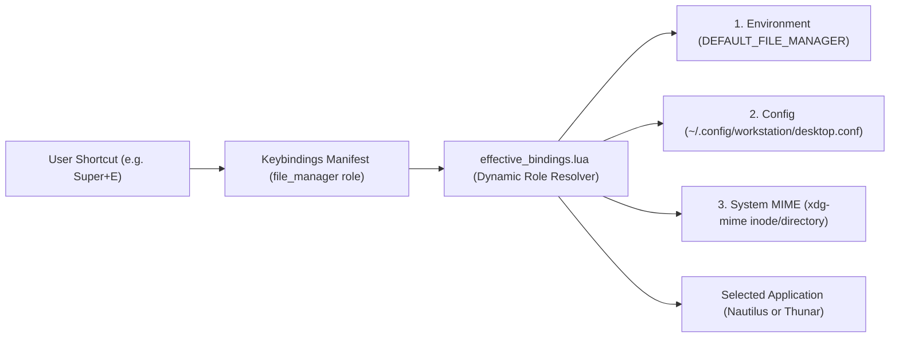
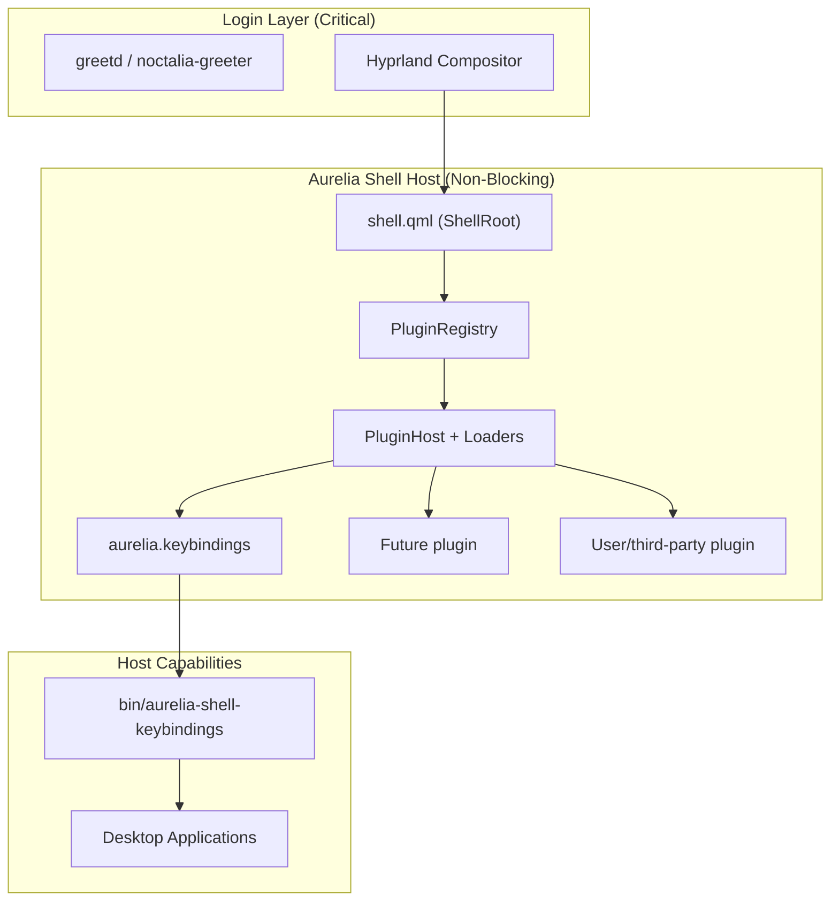

# Aurelia Shell Architecture Specification

This document establishes the foundational architecture, system boundaries, lifecycle model, plugin contract, and design principles for the **Aurelia Desktop Shell** within the Fedora Hyprland Workstation.

---

## 1. Product Identity and Runtime Boundaries

| Entity | Role | Ownership & Boundaries |
| :--- | :--- | :--- |
| **Aurelia Shell** | Workstation Desktop Shell Product | High-level resident desktop shell composed of manifest-backed plugins (Keybindings palette, App Launcher, Status Bar, Notification Center, Docks, Overlays). Owns shared services, lifecycle, IPC, presentation composition, and design system tokens. |
| **Quickshell** | Low-Level Wayland/QtQuick Engine | Low-level C++/Qt6/Wayland runtime engine. Executes QML scripts, exposes Wayland protocol extensions (layer-shell, foreign toplevel, IPC sockets), and manages hardware surfaces. |
| **Noctalia** | Peer Workstation Desktop Environment | Independent desktop shell environment (Rust/Wayland). Coexists as a peer; not an engine or parent of Aurelia. |
| **Workstation OS / Fedora** | Operating System & Integration | Host OS providing kernel, drivers, systemd user services, D-Bus session bus, font packages, and MIME associations. |

### Architectural Principle: Engine vs. Product
**Quickshell is an engine; Aurelia is the product.**
Aurelia Shell uses Quickshell as its execution engine in the same manner that a desktop application uses Qt or GTK. Aurelia components must never expose Quickshell implementation details to end users, nor should system architecture treat Quickshell as synonymous with Aurelia.

---

## 2. Peer Desktop Environments & Coexistence Model

The Fedora Hyprland Workstation supports multiple desktop shell environments:

1. **Independent Environment Identity**:
   - `desktop.environment.noctalia` and `desktop.environment.aurelia` are registered as peer desktop environment components.
   - Mutual exclusion at the full environment level prevents running conflicting global desktop shells simultaneously.

2. **Component-Level Modular Coexistence**:
   - Individual Aurelia plugins (such as **Aurelia Keybindings**) can run alongside Noctalia without requiring a second desktop shell.
   - Provider selection (e.g., `keybindings.provider = aurelia`) is decoupled from desktop shell selection (`DESKTOP_SHELL=noctalia`).
   - Inactive Aurelia plugins remain completely unloaded in memory via conditional `Loader` controls owned by `aurelia-shell/services/PluginHost.qml`.

3. **Cross-Shell Portability Policy**:
   - All core business logic, application resolution, shortcut parsing, and command execution reside in independent CLI backends (`bin/workstation-*`) and Lua modules (`dotfiles/hypr/*.lua`).
   - QML layers act strictly as presentation surfaces that consume structured JSON and communicate over standard IPC.
   - Should the workstation ever switch compositors or run alternative shells, the entire keybinding and application model remains 100% portable and intact.

4. **Plugin Boundary**:
   - The canonical source package is `aurelia-shell/`; `dotfiles/aurelia` is a compatibility symlink for existing installer paths.
   - First-party plugins live under `aurelia-shell/plugins/`; user plugins live under `~/.config/aurelia/plugins/<plugin-id>/`.
   - `shell.qml` provides the resident host only. `services/PluginRegistry.qml` discovers and validates manifests, while `services/PluginHost.qml` owns Loader lifecycle and plugin calls.

---

## 3. Generic User Intent & Role-Based Application Model

Workstation shortcuts and launcher actions express **generic user intent** rather than rigid bindings to hardcoded binary names:



### Role Mapping Hierarchy
- **File Manager (`file_manager` / `files.default`)**: Bound to `Super+E`. Dynamically resolves to `nautilus` (default) or `thunar` based on system MIME defaults, `desktop.conf`, or `DEFAULT_FILE_MANAGER`.
- **Terminal (`terminal` / `terminal.default`)**: Bound to `Super+Return`. Dynamically resolves to `kitty` (default) or `foot` based on `desktop.conf` or `DEFAULT_TERMINAL`.
- **Browser (`browser` / `browser.default`)**: Bound to `Super+B`. Dynamically resolves to `chromium-browser` (default) or `firefox` based on system MIME defaults, `desktop.conf`, or `DEFAULT_BROWSER`.
- **Direct Application Actions**: Concrete applications (`files.nautilus`, `files.thunar`, `terminal.kitty`, `terminal.foot`, `browser.chromium`, `browser.firefox`) exist as unbound actions in the manifest. Users can bind explicit shortcuts to specific applications without mutating or breaking role actions.

### 3.1 Workstation Application Registry & Action Registry
The shell architecture enforces a strict separation between discovering installed applications and managing bound/unbound shortcuts:
1. **Workstation Application Registry (`application_registry.lua`)**: Discovers installed graphical applications from standard XDG directories (`$XDG_DATA_HOME/applications`, `$XDG_DATA_DIRS/applications`). Parses `.desktop` files with a hardened, structured parser without `eval` or shell interpolation, stripping Freedesktop field codes with a lazy process-lifetime cache and explicit invalidation/refresh.
2. **Action Registry**: Represents the universe of configurable actions (`keybindings_manifest.lua` + `~/.config/hypr/user_actions.json`). User-added applications receive stable identities prefixed with `app:<desktop_id>`.
3. **Effective Bindings Engine (`effective_bindings.lua`)**: Resolves dynamic roles, merges user overrides (`keybindings_overrides.json`), and serializes structured JSON for consumption by Aurelia components.

---

## 4. Universal Aurelia Plugin Contract

Aurelia Shell plugins are heterogeneous in structure. Plugins may be floating palettes, full-width status bars, edge docks, notification overlays, or background services. Therefore, the plugin contract enforces universal lifecycle and communication guarantees rather than rigid UI file structures:

### 4.1 Lifecycle & Readiness
1. **Conditional Activation**:
   - Every plugin is declared by a validated `manifest.json` and loaded by the resident `PluginHost` with a conditional `Loader`:
     ```qml
     Loader {
         id: pluginLoader
         active: pluginHost.shouldLoad(pluginId)
         source: pluginRegistry.entryPointUrl(pluginId, pluginKind)
     }
     ```
   - When disabled, the component consumes 0 MB of RAM and 0% CPU.
2. **Deterministic Readiness Probing (`ping`)**:
   - Panel, overlay, and menu entry points expose `open(payloadJson)` and `close()`; services may remain mounted without a window.
   - The host exposes a non-mutating `ping()` and plugin-specific IPC targets may expose their own health methods.
   - Dispatch scripts must probe the resident host via `ping` before triggering state transitions (`summon`, `hide`, `toggle`).
   - Process existence alone is never treated as readiness.

### 4.2 IPC Endpoint Interface
- The resident host registers one stable `shell` target with `ping`, `summon`, `hide`, `toggle`, `call`, `rescanPlugins`, `reloadConfig`, `setPluginEnabled`, and `listPlugins`.
- Each plugin may register a plugin-scoped target (for example, `aurelia.keybindings`) with explicitly typed methods.
- Deprecated or renamed targets must provide thin forwarding shims (for example, `hotkeys` delegating directly to the Keybindings plugin) rather than duplicating implementation blocks.

### 4.3 Process & Execution Safety
   - **Decoupled CLI Backend**: Core data aggregation, state validation, and system actions must live in a companion CLI binary (`bin/workstation-<component>`); plugin QML only presents state and dispatches approved IPC actions.
- **Structured `argv` Dispatch**: All application launches must use structured string arrays (`["nautilus"]`, `["chromium-browser"]`). String concatenation, shell interpretation (`sh -c`, `bash -c`), and `eval` are strictly prohibited.
- **POSIX Double-Fork Detachment**: Child applications must be cleanly detached and immediately reparented to `init` (`PPID=1`), ensuring no persistent wrapper subshells or leaked file descriptors.

### 4.4 Resource Bounds
- **Zero Idle CPU**: No timers, animation loops, or file polling when components are hidden or inactive.
- **Log Rotation**: All component log files are strictly bounded to <= 2000 lines with atomic rotation.

---

## 5. Design System Tokens & Configuration Boundaries

Aurelia Shell establishes a centralized, token-driven design system:

```
aurelia-shell/
├── shell.qml              # Resident ShellRoot host & shell IPC
├── services/
│   ├── PluginRegistry.qml # Manifest discovery and validation
│   ├── PluginHost.qml     # Loader lifecycle and plugin calls
│   └── ShellConfig.qml    # Atomic plugin enablement state
├── plugins/
│   └── aurelia.keybindings/
│       ├── manifest.json
│       ├── KeybindingsPlugin.qml
│       └── ui/             # Private Keybindings UI and model surfaces
├── theme.conf             # Declarative configuration variables
├── theme/
│   └── Theme.qml          # Dynamic singleton token resolver
└── core/
    └── preferences.lua    # Shared preference logic
```

### 5.1 Token Scale
- **Colors**: Based on canonical Rosé Pine Moon palette (`background`, `surface`, `selection`, `text`, `textSecondary`, `border`, `borderActive`, `accent`, `love`, `pine`, `foam`, `rose`, `iris`, `gold`, `success`, `warning`, `error`).
- **Typography**: Primary monospace font family with strict fallback chain:
  `JetBrainsMono Nerd Font, Hack Nerd Font, monospace`.
- **Geometry**: Modular 4px spacing scale (`spacingXs` = 4, `spacingSm` = 8, `spacingMd` = 12, `spacingLg` = 16, `spacingXl` = 20, `spacingXxl` = 24). Standard row height = 42px.
- **Motion**: Restrained durations (`durationFast` = 100ms, `durationNormal` = 200ms) with ease-out transitions.

### 5.2 Ownership Boundaries
- **Project-Owned**: `aurelia-shell/theme.conf` defines workstation default values.
- **User-Owned**: `~/.config/aurelia/theme.conf` (or environment variable `AURELIA_THEME_CONF`) allows overriding specific variables without modifying component QML files.
- **Fallback Guarantees**: `Theme.qml` guarantees valid fallback values for every token, ensuring zero visual corruption if individual variables are omitted.

---

## 6. Failure Domains & Isolation Model



1. **Decoupling from Display Manager**:
   - In accordance with `AGENTS.md` Principle 15, all Aurelia components are classified as `WORKSTATION-REQUIRED-BUT-NONBLOCKING` or `OPTIONAL`.
   - Failure of an Aurelia component, Quickshell crash, or QML syntax error records diagnostics but **never blocks graphical session activation** (`ACTIVATION_BLOCKED=1` is never set).
2. **Single-Process Host with Isolated Plugin Loaders**:
   - All Aurelia plugins execute within a single Quickshell process managed by `shell.qml`.
   - Each plugin is isolated inside its own `Loader`. A plugin load/layout failure is recorded and does not require a second Quickshell process or block login activation.

---

## 7. AI Architectural Seam

To prepare for future AI-assisted capabilities (e.g. contextual command recommendations, natural language shortcut queries, diagnostic log analysis) without compromising workstation safety, the following architectural seam is established:

1. **Strict Interface Boundaries**:
   - Any future AI component or assistant must interface exclusively through defined CLI subcommands emitting structured JSON (e.g., `aurelia-shell-keybindings json`) or standard Quickshell IPC endpoints.
   - AI components must never directly mutate compositor memory, inject arbitrary shell scripts, or execute unverified commands.
2. **Zero `eval` / Zero Dynamic Script Injection**:
   - Commands suggested or triggered by AI must match declared manifest action IDs or pass strict application desktop-entry verification (`app:<id>.desktop`).
   - Free-form string evaluation (`eval`, `sh -c`) remains strictly prohibited under all circumstances.
3. **Privacy & Data Locality**:
   - Workstation diagnostic bundles and shortcut manifests are processed strictly locally.
   - Zero telemetry, keypress logging, or unconsented network egress is permitted.

---

## 8. Aurelia Shell Core: Foundations & Preference Model

Aurelia Shell Core provides the centralized system services, layered configuration model, motion preferences, and privacy boundaries for all desktop shell components.

### 8.1 Preference Ownership & Configuration API Boundary
Individual shell plugins do not independently parse or write shared configuration files. All shared configuration is owned and mediated through the centralized Aurelia Preferences Service (`aurelia-shell/core/preferences.lua`) and CLI utility (`bin/workstation-aurelia`):
- **Configuration Path**: `~/.config/aurelia/preferences.json` (overridable via `AURELIA_PREFERENCES_PATH`).
- **Permissions**: Atomic writes enforce secure `0600` file permissions.
- **Operations**:
  - `preference get [key]`: Read effective configuration.
  - `preference set <key> <val>`: Atomically apply a user override.
  - `preference unset <key>`: Atomically remove a user override.
  - `preference reset [--component=ID]`: Reset a component or full shell to shipped defaults.
  - `preference export`: Export portable preference documents excluding runtime state and secrets.

### 8.2 Layered Configuration Model
Configuration resolves across three deterministic layers:

```
Shipped Defaults (Lua Core)
        +
User Overrides (~/.config/aurelia/preferences.json)
        =
Effective Preferences (Runtime Model)
```

- **Fail-Safe Invariant**: If `preferences.json` is missing or corrupted by syntax errors, Aurelia safely falls back to shipped defaults without crashing or mutating the underlying file.
- **Precedence**: User overrides take precedence over shipped defaults. Component-level overrides take precedence over shell-wide defaults.

### 8.3 Namespaces, Component Reset & Plugin Extension Seams
- **`aurelia.*`**: Shell-wide settings (e.g. `aurelia.motion.enabled`, `aurelia.motion.scale`).
- **`components.<id>.*`**: First-party component settings (e.g. `components.keybindings.default_view`).
- **`plugins.<id>.*`**: User/plugin-owned settings namespace; plugin discovery and enablement remain owned by the shell registry/config service.
- **Component-Level Reset**: Invoking `reset_component("keybindings")` deletes only overrides under `components.keybindings.*`, restoring that component to shipped defaults while leaving shell-wide and sibling component preferences untouched.
- **Reset Isolation**: Reset operations strictly modify user preference overrides; they never delete logs, cache files, runtime state, or secrets.

### 8.4 Motion Preferences & Immediate Transitions
Aurelia establishes a centralized motion preference system:
- **`aurelia.motion.enabled`**: Master boolean toggle (default: `true`).
- **`aurelia.motion.scale`**: Float duration multiplier (default: `1.0`, clamped >= `0.0`).
- **Immediate Transitions**: When motion is disabled, `Theme.effectiveDurationFast` and `Theme.effectiveDurationNormal` resolve immediately to `0ms`. Component transitions and animations become instantaneous across all Aurelia surfaces without requiring QML edits.
- **Compositor Animation Boundary**: Aurelia QML components control internal animation durations (e.g., border color fades, focus transitions) via Theme duration tokens. Note that window-level surface transitions on Wayland layer-shell are managed directly by the Hyprland compositor's layer rules (e.g. `layerrule = noanim, quickshell`). Controlling window open/close animation requires compositor configuration.

### 8.5 Portable Preferences vs Machine/Runtime Data Boundary
To prepare for future portable workstation preference synchronization without building complex network services:
- **Portable Preferences (Syncable)**: User aesthetic and behavioral overrides (`aurelia.motion.*`, `components.<id>.*`).
- **Machine/Runtime Data (Excluded)**: Process IDs, socket paths, timestamps, machine IDs, tokens, secrets, passwords, hardware identities, and cache/log paths.
- **Future Sync Seam**: `workstation-aurelia preference export` emits sanitized JSON containing only portable configuration. Direct network upload, GitHub synchronization, or automated Git commits are strictly out of scope and not implemented.

### 8.6 Structured Logging & Privacy Boundary
- **Unified Log Format**: ISO-8601 UTC timestamp, log level, component name, event ID, sanitized message, and duration:
  `2026-09-05T06:00:00Z [INFO] [keybindings.navigation] Navigated to add_app (dur=12ms)`
- **Log Levels**: `DEBUG`, `INFO`, `WARN`, `ERROR`, `PERF`.
- **Privacy Redaction**: All log entries pass through `redact_sensitive()`. Tokens, API keys, secrets, passwords, and raw user search queries are strictly redacted before writing to disk.
- **Storage Bounds**: Log files are capped at `<= 2000` lines with automatic FIFO rotation.
- **Failure Isolation**: Unwritable log paths or disk failures fall back to `stderr` without throwing unhandled exceptions or terminating the desktop shell.

### 8.7 Keybindings as First Plugin Vertical Slice
Aurelia Keybindings is the first manifest-backed plugin integrated with Aurelia Shell Core. It establishes the production implementation of the plugin lifecycle, explicit plugin IPC, centralized preferences, motion scaling, structured diagnostics, and privacy protection.
