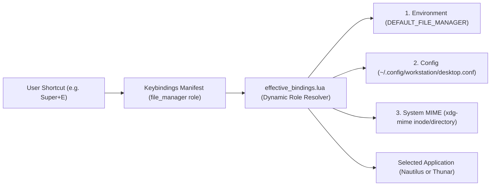
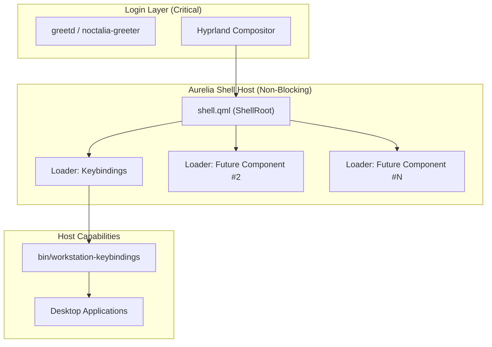

# Aurelia Shell Architecture Specification

This document establishes the foundational architecture, system boundaries, lifecycle model, component contract, and design principles for the **Aurelia Desktop Shell** within the Fedora Hyprland Workstation.

---

## 1. Product Identity and Runtime Boundaries

| Entity | Role | Ownership & Boundaries |
| :--- | :--- | :--- |
| **Aurelia Shell** | Workstation Desktop Shell Product | High-level desktop shell composed of modular components (Keybindings palette, App Launcher, Status Bar, Notification Center, Docks, Overlays). Owns presentation, user interaction, layout composition, and design system tokens. |
| **Quickshell** | Low-Level Wayland/QtQuick Engine | Low-level C++/Qt6/Wayland runtime engine. Executes QML scripts, exposes Wayland protocol extensions (layer-shell, foreign toplevel, IPC sockets), and manages hardware surfaces. |
| **Noctalia** | Peer Workstation Desktop Environment | Independent desktop shell environment (Rust/Wayland). Coexists as a peer; not an engine or parent of Aurelia. |
| **Workstation OS / Fedora** | Operating System & Integration | Host OS providing kernel, drivers, systemd user services, D-Bus session bus, font packages, and MIME associations. |

### Architectural Principle: Engine vs. Product
**Quickshell is an engine; Aurelia is the product.**
Aurelia Shell uses Quickshell as its execution engine in the same manner that a desktop application uses Qt or GTK. Aurelia components must never expose Quickshell implementation details to end users, nor should system architecture treat Quickshell as synonymous with Aurelia.

---

## 2. Peer Desktop Environments & Coexistence Model

The Fedora Hyprland Workstation supports multiple desktop shell environments:

1. **Independent Environment Identity**:
   - `desktop.environment.noctalia` and `desktop.environment.aurelia` are registered as peer desktop environment components.
   - Mutual exclusion at the full environment level prevents running conflicting global desktop shells simultaneously.

2. **Component-Level Modular Coexistence**:
   - Individual Aurelia components (such as **Aurelia Keybindings**) can run alongside Noctalia without requiring the full Aurelia desktop shell.
   - Provider selection (e.g., `keybindings.provider = aurelia`) is decoupled from desktop shell selection (`DESKTOP_SHELL=noctalia`).
   - Inactive Aurelia components remain completely unloaded in memory via conditional `Loader` controls in `dotfiles/aurelia/shell.qml`.

3. **Cross-Shell Portability Policy**:
   - All core business logic, application resolution, shortcut parsing, and command execution reside in independent CLI backends (`bin/workstation-*`) and Lua modules (`dotfiles/hypr/*.lua`).
   - QML layers act strictly as presentation surfaces that consume structured JSON and communicate over standard IPC.
   - Should the workstation ever switch compositors or run alternative shells, the entire keybinding and application model remains 100% portable and intact.

---

## 3. Generic User Intent & Role-Based Application Model

Workstation shortcuts and launcher actions express **generic user intent** rather than rigid bindings to hardcoded binary names:



### Role Mapping Hierarchy
- **File Manager (`file_manager` / `files.default`)**: Bound to `Super+E`. Dynamically resolves to `nautilus` (default) or `thunar` based on system MIME defaults, `desktop.conf`, or `DEFAULT_FILE_MANAGER`.
- **Terminal (`terminal` / `terminal.default`)**: Bound to `Super+Return`. Dynamically resolves to `kitty` (default) or `foot` based on `desktop.conf` or `DEFAULT_TERMINAL`.
- **Browser (`browser` / `browser.default`)**: Bound to `Super+B`. Dynamically resolves to `chromium-browser` (default) or `firefox` based on system MIME defaults, `desktop.conf`, or `DEFAULT_BROWSER`.
- **Direct Application Actions**: Concrete applications (`files.nautilus`, `files.thunar`, `terminal.kitty`, `terminal.foot`, `browser.chromium`, `browser.firefox`) exist as unbound actions in the manifest. Users can bind explicit shortcuts to specific applications without mutating or breaking role actions.

---

## 4. Universal Aurelia Component Contract

Aurelia Shell components are heterogeneous in structure. Components may be floating palettes, full-width status bars, edge docks, notification overlays, or background services. Therefore, the component contract enforces universal lifecycle and communication guarantees rather than rigid UI file structures:

### 4.1 Lifecycle & Readiness
1. **Conditional Activation**:
   - Every component must be declared in `dotfiles/aurelia/shell.qml` with a conditional `Loader`:
     ```qml
     Loader {
         id: myComponentLoader
         active: root.myComponentEnabled
         sourceComponent: MyComponent { ... }
     }
     ```
   - When disabled, the component consumes 0 MB of RAM and 0% CPU.
2. **Deterministic Readiness Probing (`ping`)**:
   - Every component must expose an IPC endpoint with a non-mutating `ping(): bool` method.
   - Dispatch scripts must probe readiness via `ping` before triggering state transitions (`open`, `toggle`).
   - Process existence alone is never treated as readiness.

### 4.2 IPC Endpoint Interface
- Component IPC handlers register unique, stable target names (e.g. `target: "keybindings"`).
- Supported methods are explicitly typed and allowlisted (e.g. `ping()`, `toggle()`, `open()`, `close()`, `isVisible()`).
- Deprecated or renamed targets must provide thin forwarding shims (e.g., `hotkeys` delegating directly to `keybindingsIpc`) rather than duplicating implementation blocks.

### 4.3 Process & Execution Safety
- **Decoupled CLI Backend**: Core data aggregation, state validation, and system actions must live in a companion CLI binary (`bin/workstation-<component>`).
- **Structured `argv` Dispatch**: All application launches must use structured string arrays (`["nautilus"]`, `["chromium-browser"]`). String concatenation, shell interpretation (`sh -c`, `bash -c`), and `eval` are strictly prohibited.
- **POSIX Double-Fork Detachment**: Child applications must be cleanly detached and immediately reparented to `init` (`PPID=1`), ensuring no persistent wrapper subshells or leaked file descriptors.

### 4.4 Resource Bounds
- **Zero Idle CPU**: No timers, animation loops, or file polling when components are hidden or inactive.
- **Log Rotation**: All component log files are strictly bounded to <= 2000 lines with atomic rotation.

---

## 5. Design System Tokens & Configuration Boundaries

Aurelia Shell establishes a centralized, token-driven design system:

```
dotfiles/aurelia/
├── shell.qml              # Shell composition root & IPC handlers
├── theme.conf             # Declarative configuration variables
├── theme/
│   └── Theme.qml          # Dynamic singleton token resolver
└── components/
    └── keybindings/       # Component-specific implementations
```

### 5.1 Token Scale
- **Colors**: Based on canonical Rosé Pine Moon palette (`background`, `surface`, `selection`, `text`, `textSecondary`, `border`, `borderActive`, `accent`, `love`, `pine`, `foam`, `rose`, `iris`, `gold`, `success`, `warning`, `error`).
- **Typography**: Primary monospace font family with strict fallback chain:
  `JetBrainsMono Nerd Font, Hack Nerd Font, monospace`.
- **Geometry**: Modular 4px spacing scale (`spacingXs` = 4, `spacingSm` = 8, `spacingMd` = 12, `spacingLg` = 16, `spacingXl` = 20, `spacingXxl` = 24). Standard row height = 42px.
- **Motion**: Restrained durations (`durationFast` = 100ms, `durationNormal` = 200ms) with ease-out transitions.

### 5.2 Ownership Boundaries
- **Project-Owned**: `dotfiles/aurelia/theme.conf` defines workstation default values.
- **User-Owned**: `~/.config/aurelia/theme.conf` (or environment variable `AURELIA_THEME_CONF`) allows overriding specific variables without modifying component QML files.
- **Fallback Guarantees**: `Theme.qml` guarantees valid fallback values for every token, ensuring zero visual corruption if individual variables are omitted.

---

## 6. Failure Domains & Isolation Model



1. **Decoupling from Display Manager**:
   - In accordance with `AGENTS.md` Principle 15, all Aurelia components are classified as `WORKSTATION-REQUIRED-BUT-NONBLOCKING` or `OPTIONAL`.
   - Failure of an Aurelia component, Quickshell crash, or QML syntax error records diagnostics but **never blocks graphical session activation** (`ACTIVATION_BLOCKED=1` is never set).
2. **Single-Process Host with Isolated Loaders**:
   - All Aurelia components execute within a single Quickshell process managed by `shell.qml`.
   - Each component is isolated inside its own `Loader`. A runtime exception or layout failure in one component does not terminate the host shell or affect sibling components.

---

## 7. AI Architectural Seam

To prepare for future AI-assisted capabilities (e.g. contextual command recommendations, natural language shortcut queries, diagnostic log analysis) without compromising workstation safety, the following architectural seam is established:

1. **Strict Interface Boundaries**:
   - Any future AI component or assistant must interface exclusively through defined CLI subcommands emitting structured JSON (e.g., `workstation-keybindings query --format=json`) or standard Quickshell IPC endpoints.
   - AI components must never directly mutate compositor memory, inject arbitrary shell scripts, or execute unverified commands.
2. **Zero `eval` / Zero Dynamic Script Injection**:
   - Commands suggested or triggered by AI must match declared manifest action IDs or pass strict application desktop-entry verification (`app:<id>.desktop`).
   - Free-form string evaluation (`eval`, `sh -c`) remains strictly prohibited under all circumstances.
3. **Privacy & Data Locality**:
   - Workstation diagnostic bundles and shortcut manifests are processed strictly locally.
   - Zero telemetry, keypress logging, or unconsented network egress is permitted.
